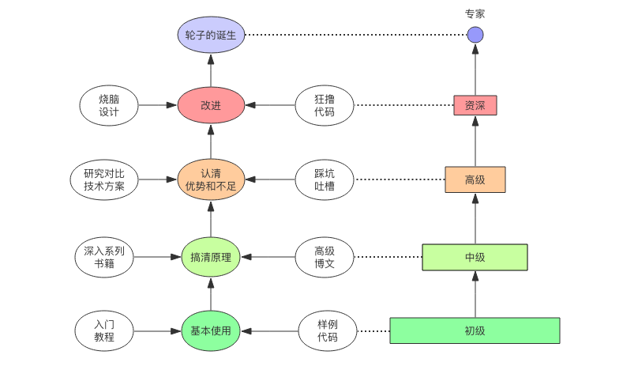

# RPC (Remote Procedure Call)

- google : gRPC
- facebook : Thrift
- twitter : Finagle
- baidu : bRPC
- tencent : Tars
- alibaba : Dubbo/SOFA
- sina : Motan

## 程序员的自我修养

- 高级程序员在技术选择的自由度上往往更大，他们不只会用，而且还知道为什么要这么用，能不能不这么用，
有没有更好的办法。

- 初级程序员只会搬砖，看到别人怎么写我就怎么写，缺乏自主思考的能力。

## 多系统数据交互的方案：
- 远程过程调用RPC
- 分布式消息队列
- HTTP请求调用
- 数据库
- 分布式缓存

## nginx与后段服务之间协议
- http
- uwsgi 二进制
- fastcgi 二进制

## 大数据 Hadoop
NameNode <-------------> DataNode
            hadoop rpc

## 同一个操作系统实例上的两个进程之间通信：
- 共享内存
- 信号量
- 文件系统
- 内核消息队列
- 管道

## 连接池
### 连接池的特点：
- 每个业务线程独享，隔离业务线程之间的资源争抢，避免并发问题
- 便于控制并发数，寻找最优并发数，避免给数据库造成雪崩压力
- 需要健康检查
    - 用户线程从连接池申请连接时候
    - 用户线程归还连接到线程池时候
    - 线程池定时对连接检查
    - 池中发现连接错误管理：
        - 抛弃当前连接，连接池的连接数量-1
        - 修复当前连接，即进行重连操作

### 安全锁：
- 锁的临界区代码避免耗时计算与IO操作
- 锁的粒度要细

### 懒惰连接缺点：
- 连接错误只有在收到用户请求时候才能发现
- 需要一个热身过程，第一个请求需要额外的建立连接时间

### 连接池申请连接的超时策略，也就是当连接池内部连接不够用时候：
- 永不超时
- 超时获取不到后，抛出异常，中断业务逻辑
- 申请新的连接给调用方。调用方归还时候，计算当前缓存的连接数量，如果超过了最大空闲连接数，
就将归还的连接销毁，即用即走。

## 多路复用（multiplexing）
多路复用的连接往往都是线程安全的，它支持多个线程同时写入请求而不会出现并发问题。
但是实现多路复用的效果难度较大，实现一个同等功能的客户端，它的工作量往往是同步的好几倍。

## 心跳
- 一种是通过请求遇到连接错误时进行重连重试，
- 另一种就是通过心跳方式告知服务器不要关闭连接。

## 操作系统特殊信号
- SIGINT；一般指代键盘的 ctrl+c 触发的 Keyboard Interrupt
- SIGTERM；当你使用不带参数的 kill 指令杀死进程时，进程会收到该信号。此信号默认行为也是退出进程，但是允许用户自定义信号处理函数。
- SIGKILL；当你使用 kill -9 杀死进程时，进程会收到信号。此信号的处理函数无法覆盖，进程收到此信号会立即暴力退出。
- SIGCHLD；子进程退出时，父进程会收到此信号。当子进程退出后，父进程必须通过 waitpid 来收割子进程，否则子进程将成为僵尸进程，直到父进程也退出了，其资源才会彻底释放。

## 收割子进程
收割子进程使用os.waitpid(pid, options)系统调用，可以提供具体 pid 来收割指定子进程，也可以通过参数 pid=-1 来收割任意子进程。

options 如果是 0，就表示阻塞等待子进程结束才会返回；如果是 WNOHANG 就表示非阻塞，有,就返回指定进程的 pid，没有,就返回 0。

waitpid 有可能抛出异常，如果指定 pid 进程不存在或者没有子进程可以收割，就会抛出 OSError(errno.ECHILD)；
如果 waitpid 被其它信号打断，就会抛出 OSError(errno.EINTR)，这个时候可以选择重试。

