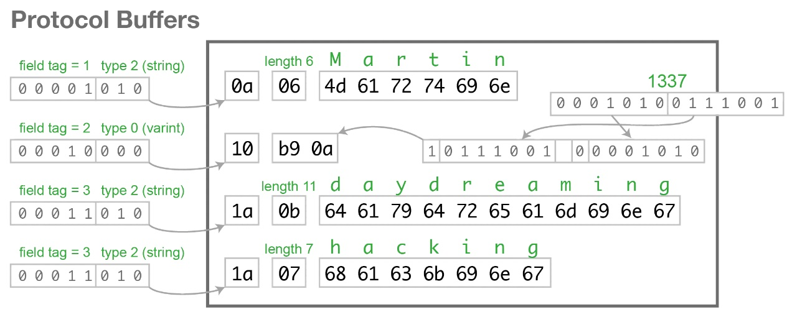

# Protobuf protocol

- 变长整数varint，
    - 数值非常小时，只需要使用一个字节来存储，数值稍微大一点可以使用 2 个字节，再大一点就是 3 个字节
    - 保留每个字节的最高位的 bit 来标识是否后面还有字节，1 表示还有字节需要继续读，0 表示到读到当前字节就结束
- zigzag 解决负数问题

```
0 => 0
-1 => 1
1 => 2
-2 => 3
2 => 4
-3 => 5
3 => 6
```

## Format

| key1 | value1 | key2 | value2 | key3 | value31 | key3 | value32 |
|------|--------|------|--------|------|---------|------|---------|

Protobuf 传输的是一系列的键值对，如果连续的键重复了，那说明传输的值是一个列表 (repeated)。图上的 key3 就是一个列表类型 (
repeated)。

### key

键 key 两部分组成：tag 和 type。

| 1   | tag(7 high bits) | 0(0代表读取到这个字节结束) | tag(4 low bits) | type(3 bits) |
|-----|------------------|-----------------|-----------------|--------------|

#### tag 字段名称对应的整数 (tag)

Protobuf 将对象中的每个字段和正数序列 (tag) 对应起来，对应关系的信息是由生成的代码来保证的。
在序列化的时候用整数值来代替字段名称，于是传输流量就可以大幅缩减。

#### type 字段类型对应的整数 (type)

Protobuf 将字段类型也和正数序列 (type) 对应起来，每一种原生的 java 类型都唯一对应一个正数，类型信息也非常节省。
type 使用 3 个 bits 表示，最多支持 8 种类型。

- byte/short/int/long/bool/enum/unsigned byte/unsigned short/unsigned int/unsigned long 这些类型都可以使用 zigzag 表示
- 而字节数组、字符串和嵌套对象都可以使用一种称之为 length 前缀 (length-delimited) 的类型来表示
- 另外 float 和 double 类型各占一个类型。

#### example
```
message Person {
    required string user_name        = 1;  // 必须字段
    optional int64  favourite_number = 2;  // 可选字段
    repeated string interests        = 3;  // 列表类型
}
```
```
var person = new Person{
    user_name: "Martin",
    favourite_number: 1337,
    interests: ["daydreaming", "hacking"]
}
```


解释一下 1337 变成 b9 0a十六进制的过程：首先转化为二进制是 0000 0101 0011 1001，
由于一个字节的最高位被是否结束标志占据，切割为两部分 000 1010 和 011 1001，
高位的两个 00 舍去。二进制小端模式颠倒高低字节位顺序 011 1001 和 000 1010，
再附上最高位的是否结束标志（1代表本字节后还有，0代表本字节结束），最终变为 1011 1001 0000 1010